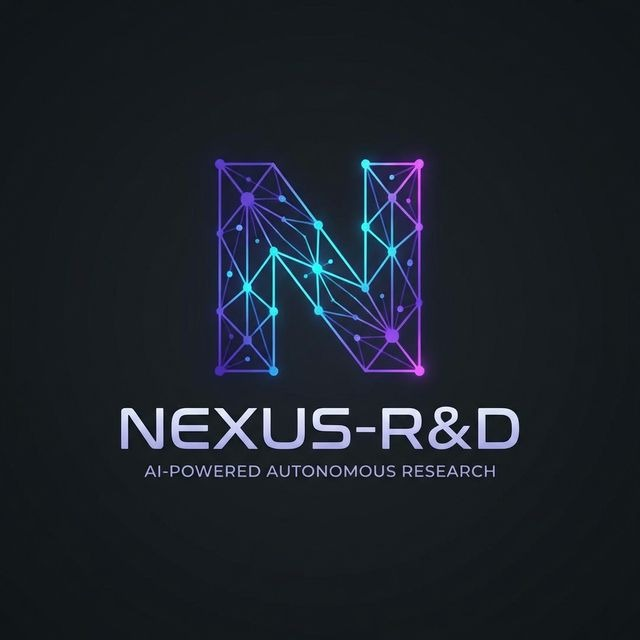

<p align="center">
  
</p>

<h1 align="center">NEXUS-R&D</h1>
<h4 align="center"><em>Next-generation Exploratory Understanding System for Research & Development</em></h4>
<h3 align="center">🧠 Autonomous Deep Research for R&D Innovation</h3>

<p align="center">
  <strong>A deep research tool that autonomously conducts patent research, market analysis, and technology trend forecasting to identify and evaluate potential innovation opportunities, streamlining the R&D process for companies.</strong>
</p>

<p align="center">
  
  
  
  
</p>

<p align="center">
  <em>Built for <strong>VETROX AGENTIC 3.0 Hackathon</strong></em>
</p>

---

## 🎯 The Scholar Track: Deep Research

> *"Search engines give links; we need answers."*

NEXUS-R&D is a **deep research tool** that autonomously conducts:

- **Patent Research** — Analyzes global patent databases, extracts claims, maps citation networks
- **Market Analysis** — Tracks startup funding, M&A activity, competitive landscapes
- **Technology Trend Forecasting** — Predicts technology maturity and optimal innovation timing

The result? **Actionable innovation opportunities** that streamline the R&D process for companies—from Fortune 500 enterprises to ambitious startups.

---

## 🚀 Why Gemini 3?

NEXUS-R&D is built on the **absolute frontier**—Gemini 3 is not just an upgrade, it's a paradigm shift for agentic workflows:

| Gemini 3 Capability | How NEXUS-R&D Leverages It |
|---------------------|----------------------------|
| **Superior Inference** | Complex patent claim analysis without hallucinations |
| **True Multimodality** | Understands patent diagrams, market charts, and technical figures |
| **Ultra-Low Latency** | Real-time agent coordination across 5 specialized agents |
| **1M+ Token Context** | Holds entire research sessions in memory for coherent synthesis |
| **Native Tool Use** | Agents autonomously decide when to search, verify, or synthesize |

```python
# Gemini 3 powers every agent decision
model = genai.GenerativeModel('gemini-3-deep-think')

# Deep reasoning with extended thinking capabilities
response = await model.generate_content(
    research_prompt,
    generation_config={
        "temperature": 0.7,
        "thinking_mode": "extended"  # Gemini 3 Deep Think
    }
)
```

---

## 🏗️ System Architecture

```
┌─────────────────────────────────────────────────────────────────────────────────┐
│                              NEXUS-R&D ARCHITECTURE                              │
└─────────────────────────────────────────────────────────────────────────────────┘

    ┌──────────────────────────────────────────────────────────────────────────┐
    │  📊 DATA SOURCES (8 APIs)                                           │
    │  ┌─────────────┐ ┌─────────────┐ ┌─────────────┐ ┌─────────────┐         │
    │  │   USPTO     │ │   Google    │ │   arXiv     │ │  PubMed     │         │
    │  │  Patents    │ │  Patents    │ │  (CS/Math)  │ │ (Biomedical)│         │
    │  └──────┬──────┘ └──────┬──────┘ └──────┬──────┘ └──────┬──────┘         │
    │  ┌─────────────┐ ┌─────────────┐ ┌─────────────┐ ┌─────────────┐         │
    │  │  CrossRef   │ │  Semantic   │ │  NewsAPI    │ │   Serper    │         │
    │  │ (130M+ DOIs)│ │  Scholar    │ │  (Markets)  │ │  (Search)   │         │
    │  └──────┬──────┘ └──────┬──────┘ └──────┬──────┘ └──────┬──────┘         │
    └─────────┼───────────────┼───────────────┼───────────────┼────────────────┘
              │               │               │               │
              ▼               ▼               ▼               ▼
    ┌──────────────────────────────────────────────────────────────────────────┐
    │  🤖 AGENT LAYER - The Five Scholars                                      │
    │                                                                          │
    │  ┌────────────┐  ┌────────────┐  ┌────────────┐                         │
    │  │ 🔍 Patent  │  │ 📈 Market  │  │ 🔬 Tech    │                         │
    │  │   Scout    │  │  Analyst   │  │  Trend     │                         │
    │  └─────┬──────┘  └─────┬──────┘  └─────┬──────┘                         │
    │        │               │               │                                 │
    │        └───────────────┼───────────────┘                                 │
    │                        ▼                                                 │
    │               ┌────────────────┐                                         │
    │               │ 🛡️ Verifier   │  ◄─── Adversarial Fact-Checking         │
    │               └───────┬────────┘                                         │
    │                       ▼                                                  │
    │               ┌────────────────┐                                         │
    │               │ ✨ Synthesizer │  ◄─── Whitespace & Opportunity Scoring  │
    │               └───────┬────────┘                                         │
    └───────────────────────┼──────────────────────────────────────────────────┘
                            │
              ┌─────────────┴─────────────┐
              ▼                           ▼
    ┌──────────────────┐       ┌──────────────────────┐
    │  🧠 GEMINI 3     │       │  🌐 FRONTEND         │
    │  Deep Think      │       │  Next.js 15          │
    │  ─────────────── │       │  ───────────────     │
    │  • Reasoning     │       │  • Real-time WS      │
    │  • Analysis      │       │  • Citation Graph    │
    │  • Synthesis     │       │  • PDF Export        │
    └──────────────────┘       └──────────────────────┘
```

### Data Flow

```
User Query ──▶ Orchestrator ──▶ Parallel Agent Execution ──▶ Verification ──▶ Synthesis ──▶ Report
                    │                      │                      │              │
                    ▼                      ▼                      ▼              ▼
              Session Memory         8 API Calls            Contradiction   Investment
              & State Mgmt          in Parallel               Search        Scoring
```

### The Five Scholars (Agent Roles)

| Agent | Expertise | Research Focus |
|-------|-----------|----------------|
| **Patent Scout** | IP Intelligence | Claim extraction, citation networks, prior art |
| **Market Analyst** | Business Intelligence | Startup funding, M&A, market sizing |
| **Tech Trend** | Academic Intelligence | Paper analysis, technology maturity curves |
| **Verifier** | Adversarial Skeptic | Contradiction search, fact-checking |
| **Synthesizer** | Strategic Analyst | Whitespace scoring, opportunity ranking |

---

## 🧬 Philosophy of Design

### 1. Recursive Knowledge Spirals

**Assumption Questioned**: *Why do research tools perform flat, one-shot searches?*

We designed NEXUS-R&D to **spiral deeper**. Each discovery becomes the seed for new investigations:

```
Query: "Solid-state batteries"
  └─→ Patent found: "Toyota sulfide electrolyte process"
       └─→ Sub-query: "Manufacturing challenges in sulfide electrolytes"
            └─→ Market signal: "QuantumScape $500M funding"
                 └─→ Sub-query: "QuantumScape ceramic vs Toyota sulfide"
                      └─→ Innovation Whitespace: "Hybrid ceramic-sulfide manufacturing"
```

**The Elegance**: Linear search finds what exists. Recursive search finds what's *missing*—the whitespace.

### 2. Epistemic Verification Protocol

**Assumption Questioned**: *Why do AI systems accept their own outputs at face value?*

We implemented an **adversarial verifier** inspired by Popper's falsificationism. Claims gain credibility not by confirmation, but by *surviving challenges*:

```python
async def verify_claim(self, claim: str, sources: List[Source]) -> VerificationResult:
    # The Verifier actively seeks contradictions
    counter_evidence = await self.search_contradictions(claim)
    
    if counter_evidence:
        return DisputedClaim(claim, counter_evidence, confidence=0.4)
    
    # Only surviving claims are promoted
    return VerifiedFact(claim, confidence=0.9)
```

**The Elegance**: An AI that questions itself produces outputs you can trust.

### 3. Shared Memory Architecture

**Assumption Questioned**: *Why do agents work in silos?*

Our agents share a **recursive memory** where:
- Discoveries from Patent Scout inform Market Analyst queries
- Citation networks build organically across sessions
- Contradictions are flagged globally

**The Elegance**: Collaboration beats isolation. Always.

### 4. Investment Opportunity Scoring

**Assumption Questioned**: *Innovation potential is binary (good/bad)?*

We designed a **multi-factor algorithm** that captures nuance:

```
Investment Score = 
    (Claim Confidence × 25) + 
    (Market Impact × 25) + 
    (Timing Window × 25) + 
    (Competition Gap × 25)
```

**The Elegance**: The best innovations aren't just valuable—they're *timely*.

---

## ✨ International-Level Innovation Features

> *Features that set NEXUS-R&D apart from any existing solution*

### 🎯 Innovation Whitespace Mapping *(First of its Kind)*
Autonomously identifies gaps where **patent coverage is thin**, **market demand exists**, and **technology is maturing**—the sweet spots for R&D investment. Unlike keyword matching, this uses Gemini 3's reasoning to discover what *doesn't exist yet*.

### �️ Epistemic Verification Protocol *(Novel)*
Multi-agent adversarial verification system. An **AI skeptic challenges every claim**, actively searching for contradicting evidence before finalizing insights. Inspired by Popper's philosophy of falsification.

### 🔄 Recursive Knowledge Spirals *(Deep Research)*
Each discovery triggers new targeted searches. A single query can spawn **100+ focused sub-investigations**, building deep domain understanding 4 levels deep. This is deep research, not flat search.

### ⏱️ Temporal Innovation Forecasting *(Predictive)*
Predicts **technology maturation timelines**, optimal patent filing windows, and competitive threat emergence using pattern analysis across historical data.

### 📊 Interactive Citation Network Graph
Real-time D3.js-powered visualization of **patent citation relationships**, revealing technology lineages, influence patterns, and key players in any domain.

### 🎯 Competitive Threat Radar
Surfaces **emerging competitors** based on patent filing velocity, funding patterns, and market entry signals—before they become obvious threats.

### 📄 Investment-Ready PDF Reports
One-click export of comprehensive **Innovation Opportunity Reports** with scored whitespace opportunities, competitive analysis, and strategic recommendations.

---

## 🚀 Getting Started

### Prerequisites
- Python 3.11+
- Node.js 18+
- [Gemini API Key](https://ai.google.dev/) (Free tier available)

### Quick Start

```bash
# Clone
git clone https://github.com/MUTHUKUMARAN-K-1/NEXUS-R-D.git
cd NEXUS-R-D

# Backend
cd backend
pip install -r requirements.txt
echo "GEMINI_API_KEY=your_key_here" > .env
uvicorn main:app --reload

# Frontend (new terminal)
cd frontend
npm install
npm run dev
```

Open **http://localhost:3000** and start researching!

---

## 📁 Project Structure

```
nexus-rd/
├── backend/
│   ├── agents/              # The Five Scholars
│   │   ├── base_agent.py    # Gemini 3 integration
│   │   ├── patent_scout.py  # Patent analysis
│   │   ├── market_analyst.py
│   │   ├── tech_researcher.py
│   │   ├── verifier.py      # Adversarial verification
│   │   └── synthesizer.py   # Report generation
│   ├── core/
│   │   ├── orchestrator.py  # Agent coordination
│   │   ├── state_manager.py # Session memory
│   │   └── pdf_generator.py # Export
│   └── main.py              # FastAPI
│
├── frontend/
│   ├── app/                 # Next.js 15
│   ├── components/
│   │   ├── ResearchDashboard.tsx
│   │   └── CitationGraph.tsx
│   └── context/
│       └── ThemeContext.tsx
│
└── README.md                # You are here
```

---

## 🔑 Environment Variables

```env
# Required
GEMINI_API_KEY=your_gemini_api_key

# Optional (enhanced data)
SERPER_API_KEY=your_serper_key
NEWS_API_KEY=your_newsapi_key
```

---

## 🎬 Demo Video

[**▶️ Watch the 3-minute demo →**](#)

*Watch NEXUS-R&D autonomously research "solid-state batteries":*
1. 5 agents coordinate in real-time
2. 100+ sub-queries spiral recursively
3. Claims verified through adversarial search
4. Final report with scored opportunities

---

## 🏆 VETROX AGENTIC 3.0 — The Scholar Track

NEXUS-R&D is built for teams that need **answers, not links**:

✅ **Recursive Deep Research** — Queries spawn sub-queries 4 levels deep  
✅ **Cross-Reference Synthesis** — 50+ sources unified into coherent insights  
✅ **Adversarial Verification** — AI skeptic challenges every claim  
✅ **Structured Output** — Investment-ready innovation reports  
✅ **Gemini 3 Core** — Frontier reasoning at every decision point  

---

## 📜 License

MIT License — see [LICENSE](LICENSE) for details.

---

<p align="center">
  <strong>🧠 NEXUS-R&D: Recursive Intelligence for the Scholar's Age</strong>
  <br/>
  <em>Built for VETROX AGENTIC 3.0 | Powered by Gemini 3</em>
</p>
